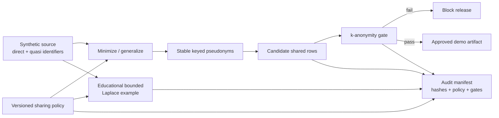

# Privacy-Preserving Data Sharing — Educational Demo


A policy-driven, deterministic demonstration of data minimization, stable
pseudonyms, k-anonymity diagnostics, a bounded noisy aggregate, and release
audit evidence.

> [!CAUTION]
> This repository uses **synthetic people and synthetic data**. It is not a
> production privacy platform, token vault, security boundary, cryptographic
> product, legal compliance decision, or safe differential-privacy release
> system. Its seeded noise is intentionally reproducible for tests and must not
> be used to publish real statistics.

## What the demo does

1. Loads a versioned sharing policy.
2. Drops direct identifiers selected by policy.
3. Produces stable keyed pseudonyms for approved linking fields.
4. Generalizes age and annual spend into bands.
5. Evaluates equivalence classes against a minimum `k`.
6. Calculates one educational bounded noisy mean.
7. Records policy, input, output, transformations, gates, and SHA-256 provenance
   in an audit manifest.

The released row-level candidate intentionally excludes exact age, exact spend,
name, postal code, and original identifiers. The noisy aggregate is generated
from the source values in a separate path.

## Architecture



## Threat-model honesty

This demo helps discuss design choices; it does not solve the full threat model.

| Demonstrated | Explicitly not provided |
|---|---|
| Deterministic namespaced HMAC pseudonyms | Vault, key rotation, access control, revocation |
| Identifier dropping and generalization | Protection from all auxiliary-data linkage |
| k-anonymity equivalence-class report | l-diversity, t-closeness, membership protection |
| Bounded Laplace-noise calculation | Secure randomness, composition accountant, user contribution ledger |
| File and policy hashes | Signatures, tamper-proof logs, attestation |
| Policy release gate | Legal/privacy review or regulatory certification |

Stable pseudonyms remain linkable by design. Low-entropy inputs can still be at
risk if key management is weak. Passing k-anonymity does not imply anonymity.

## Quick start

Python 3.11+ is sufficient; the runtime has no third-party dependency.

```bash
make check
make demo
```

The demo writes:

```text
.artifacts/demo/
├── shared-dataset.csv
├── k-anonymity-report.json
├── dp-aggregate.json
├── audit-manifest.json
└── summary.json
```

Expected gate summary:

```json
{
  "dp_query": "EDUCATIONAL_ONLY",
  "k_anonymity": "PASS",
  "released_rows": 8,
  "status": "PASS",
  "synthetic_demo": true
}
```

## Policy

[`policies/research-share.policy.json`](policies/research-share.policy.json)
declares:

- direct-identifier actions (`drop` or `tokenize`);
- quasi-identifiers used for the k-anonymity gate;
- minimum `k = 2`;
- one bounded aggregate with `epsilon = 1.0`;
- a seven-day illustrative retention period;
- limitations that downstream reviewers must acknowledge.

The `example.invalid` email domain and the obvious “Demo” names prevent the
fixture from being confused with real personal information.

## Differential-privacy example

The function clamps every contribution to `[0, 10,000]`, splits epsilon between
a bounded sum and count, adds Laplace noise to each, and derives a bounded mean.
It also reports its epsilon allocation and limitations.

The deterministic seed exists only so tests and interviews can reproduce an
answer. Reusing deterministic noise, issuing correlated queries, or omitting
composition accounting can destroy privacy. A real implementation requires a
reviewed library, secure release controls, contribution bounding per privacy
unit, and a persistent budget ledger.

## Audit evidence

The manifest records canonical policy hash, input and output file hashes,
policy version, row counts, transformations, gate states, and an explicit
educational-limitations acknowledgement. Hashes help with provenance comparison
but do not make the audit log immutable or trusted.

## Repository map

```text
.
├── .github/workflows/ci.yml
├── data/synthetic_customers.csv
├── policies/research-share.policy.json
├── docs/
│   ├── adr-001-layered-privacy-controls.md
│   └── runbook.md
├── src/privacy_share/
└── tests/
```

See the [ADR](docs/adr-001-layered-privacy-controls.md) and
[release runbook](docs/runbook.md).

## Production evolution

Production work would require privacy counsel and threat modeling, managed key
custody, authorization, isolation, reviewed de-identification methods, a
well-defined privacy unit, secure randomness, budget composition, immutable
audit storage, retention enforcement, incident response, and independent
validation. None is claimed here.
